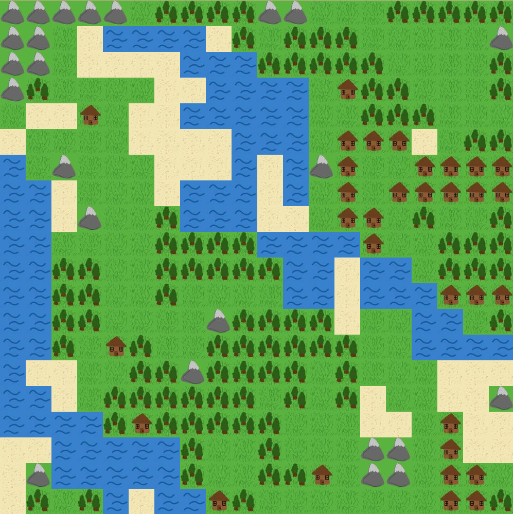
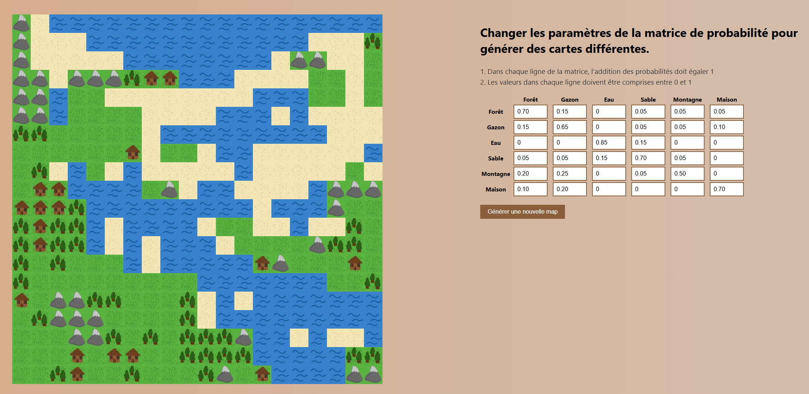
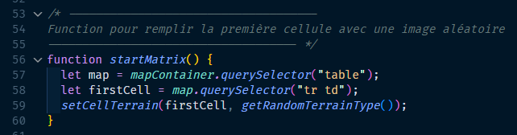
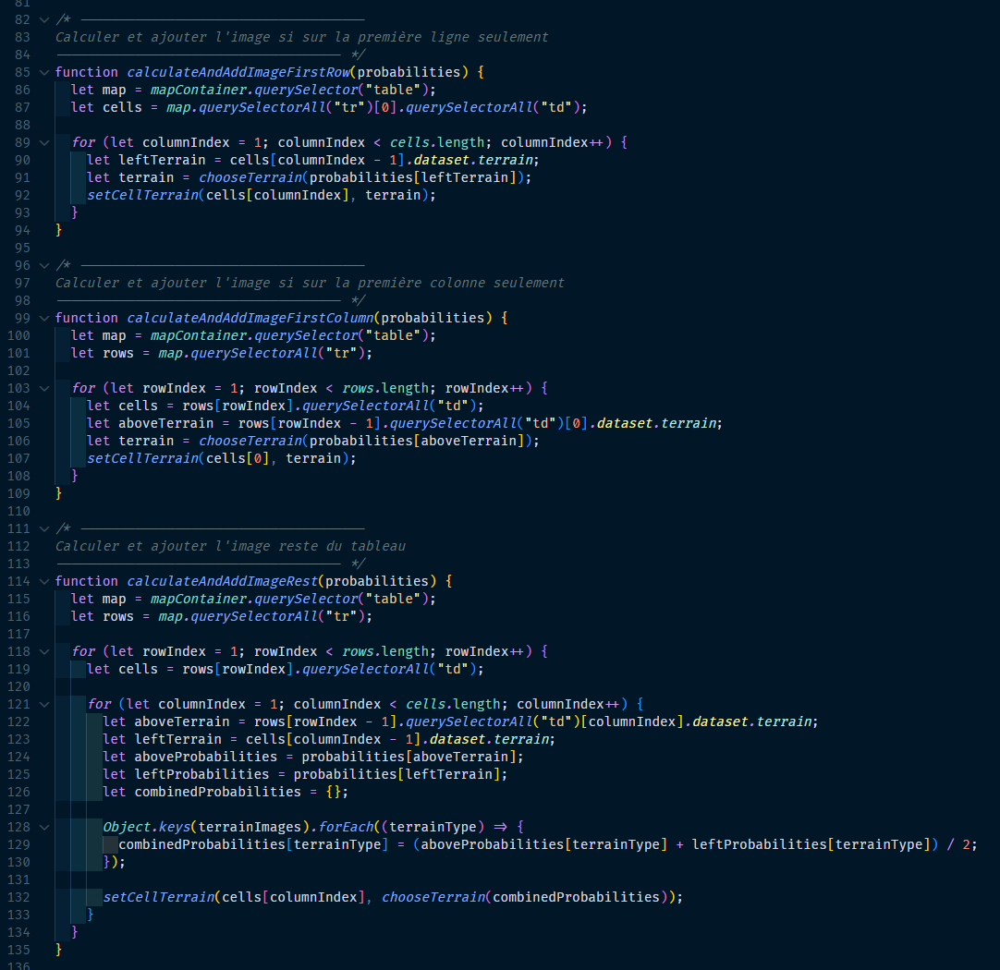

J'ai décidé d'explorer les possibilités de génération de contenu aléatoire en utilisant les matrices de probabilité que j'ai appris durant mes cours de mathématiques de jeu à l'université.

Le projet consiste à générer des cartes de jeu en 2D de manière aléatoire, en utilisant une matrice de probabilité pour déterminer la disposition des éléments sur la carte. Chaque élément a une probabilité spécifique d'apparaître à un endroit donné par rapport aux autres éléments, ce qui permet de créer des cartes uniques à chaque génération qui suivent les règles de probabilité définies.

Le projet a été développé en utilisant JavaScript pour la génération de la carte et l'application des matrices de probabilité. L'interface utilisateur permet aux utilisateurs de visualiser la carte générée et d'interagir avec elle, en modifiant les paramètres de probabilité pour influencer le résultat final.

La génération de la map commence par prendre le premier élément (1,1) de la carte et lui place une image aléatoire.

Ensuite, le programme prend l'élément suivant (1,2) et lui place une image aléatoire en fonction de la probabilité de l'image précédente (1,1). Tout cela ce fait de manière récursive pour remplir toute la carte. Commencent par la première ligne, ensuite la première colonne et ensuite fait des calculs de probabilité pour remplir les cases du milieu restantes.

Chaque fois que la carte est générée, le joueur peut cliquer sur un bouton pour générer une nouvelle carte aléatoire. Cette petite expérimentation met en évidence l'application des concepts mathématiques dans le développement de jeux vidéo et démontre comment les matrices de probabilité peuvent être utilisées pour créer des cartes 2D de jeu aléatoires, mais en suivant des règles.

Le code complet de ce projet est disponible à l'utilisation dans ce Github pour ceux qui souhaitent explorer davantage les détails techniques et les algorithmes utilisés pour la génération de cartes.
